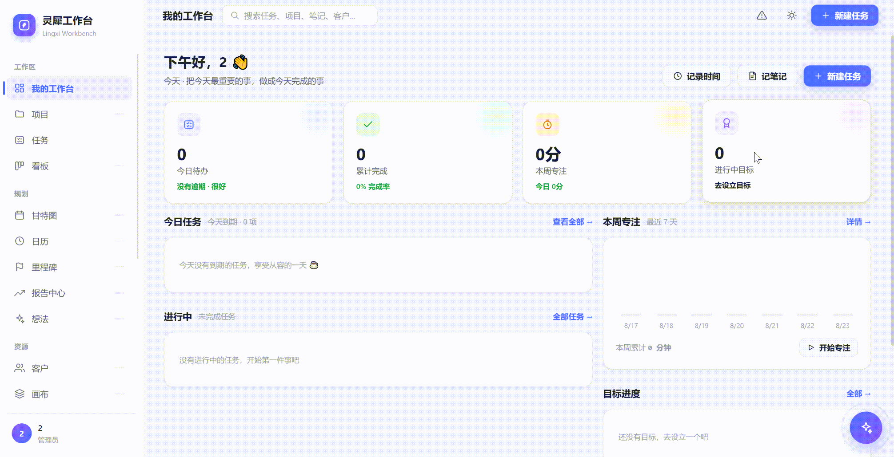
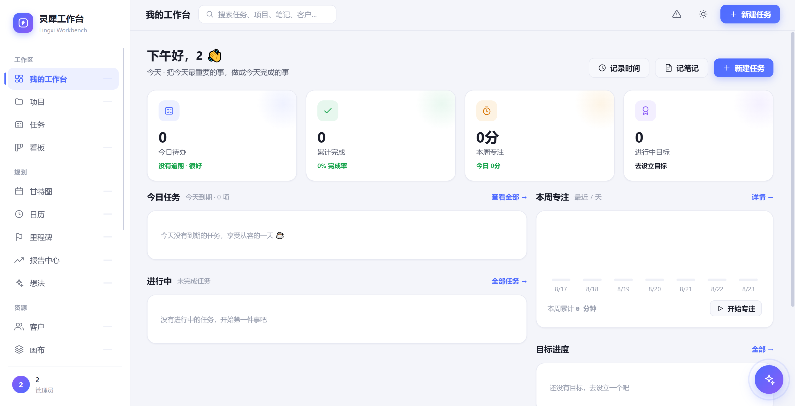
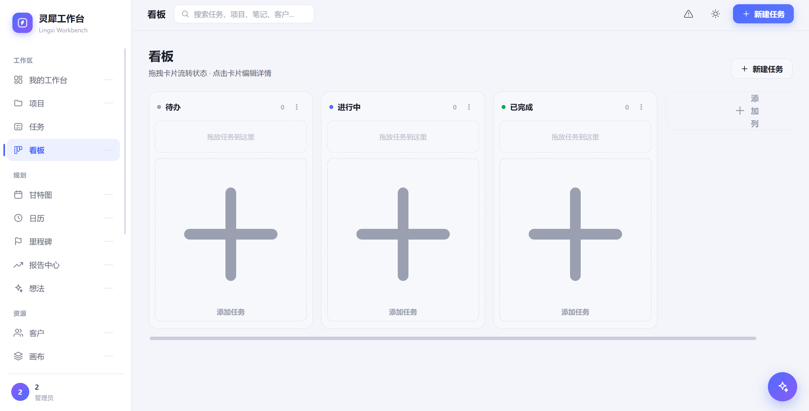
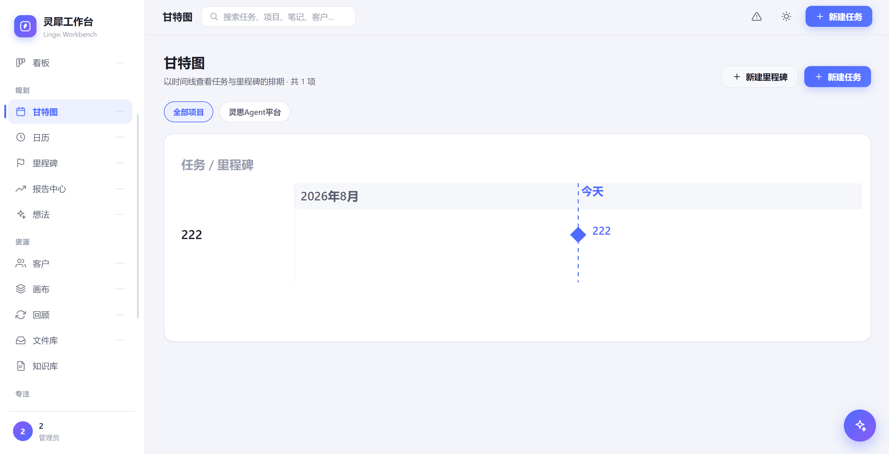
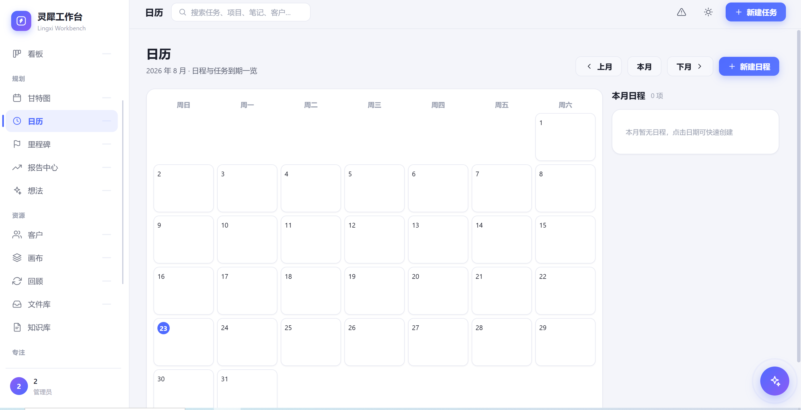
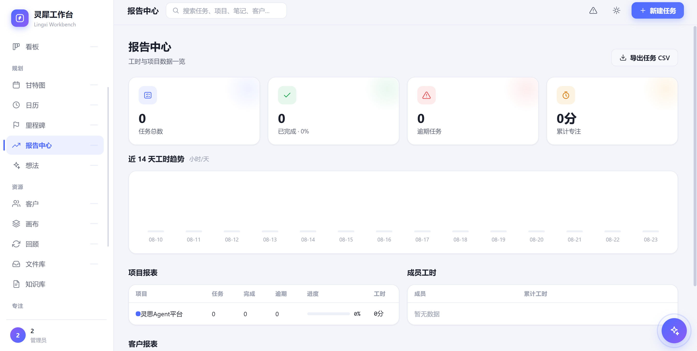
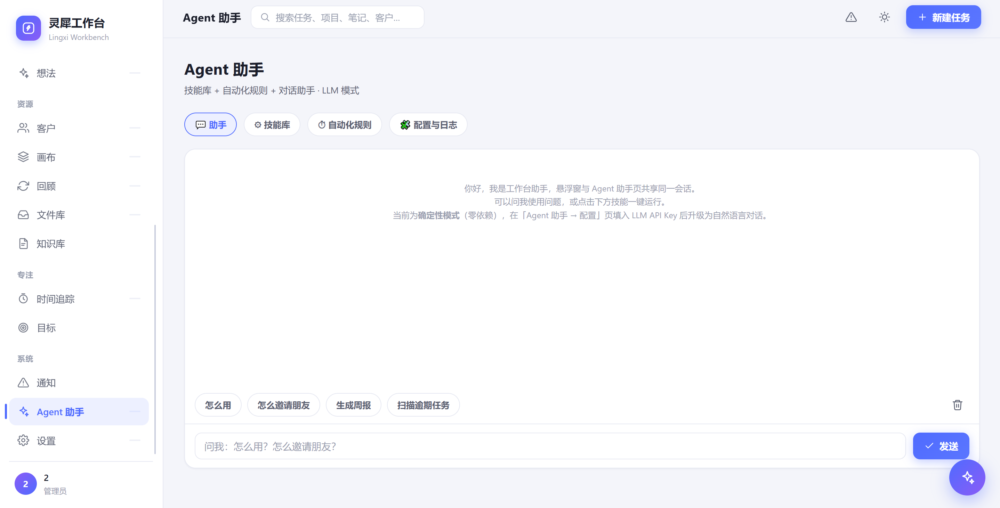
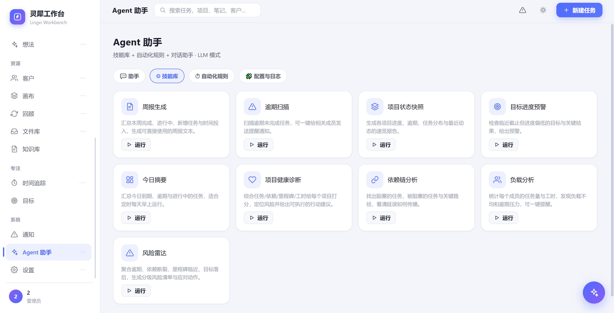
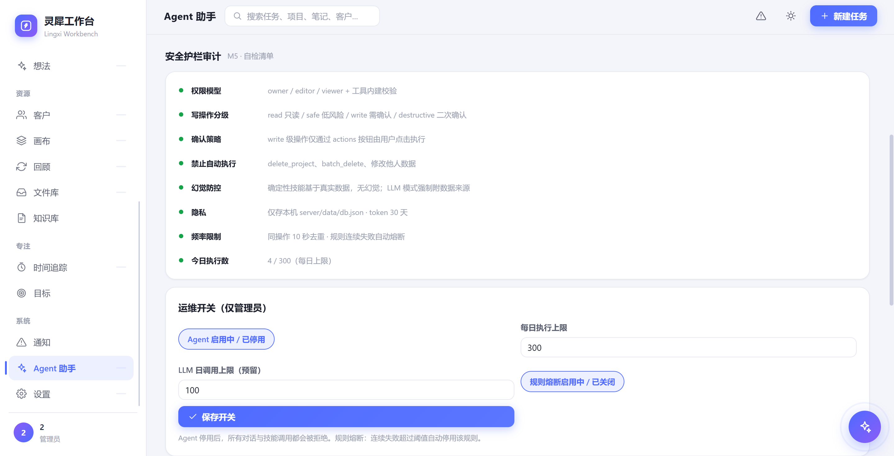
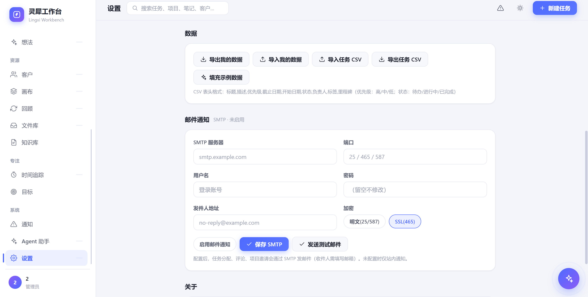

# 灵犀工作台 · Lingxi Workbench

<div align="center">

**一个前后端一体、零外部依赖、原生全中文的开源协作工作台。**

一个人用它管项目，一群人用它协同办公。

[特性](#特性) · [快速开始](#快速开始) · [应用场景](#应用场景) · [功能一览](#功能一览) · [内置 Agent](#内置-agent-助手) · [部署](#部署) · [技术架构](#技术架构) · [参与贡献](#参与贡献) · [许可](#许可)

</div>

---

## 这是什么？

灵犀工作台把项目管理里最常用的一整套能力——**任务、看板、甘特图、日历、目标、知识库、客户、想法、画布、文件**——做进一个开箱即用的网页应用。

它的特别之处在于「轻」：

- **后端只用 Node.js 标准库**（`node:http`），没有任何 npm 依赖；
- **前端是纯原生 JS + 内联 SVG**，没有框架、没有打包编译步骤；
- **数据写在本地一个 JSON 文件里**，备份和迁移就是复制一个文件；
- **界面全中文、零翻译腔**，深色 / 浅色主题一键切换。

下载源码 → `node server/server.js` → 打开浏览器，就能用。想邀请朋友一起协作？建个项目、发个邀请就行。

---

## 动态演示

<p align="center">
  
</p>

> 约 100 秒实机录屏：工作台总览 → 任务看板 → 甘特排期 → 唤起右下角 Agent 悬浮窗做周报与跨实体联动分析。

---

## 特性

- 🇨🇳 **全中文界面**：从菜单到提示语，原生中文，无翻译腔。
- 🪶 **零依赖、零构建**：后端仅用 Node 标准库，前端纯原生 JS。无需 `npm install`、无需打包，下载即跑。
- 🎨 **精致设计**：字节跳动风格视觉，圆角卡片、柔和阴影、渐变与微动效；深色 / 浅色双主题一键切换。
- 🔁 **完整的项目管理闭环**：任务（列表 / 表格双视图、子任务、依赖、里程碑）· 看板拖拽 · 甘特图排期 · 日历 · 目标（OKR）· 时间追踪 · Markdown 知识库 · 工时报告。
- 👥 **多用户协作**：注册即成为管理员 → 建项目 → 邀请成员 → 分配角色（负责人 / 可编辑 / 只读）；任务分配与评论触发站内通知。
- 💡 **团队工具箱**：想法投票、SWOT / 精益等 7 种画布、客户管理、回顾复盘一应俱全。
- 🤖 **内置 Agent 助手**：一键周报、逾期扫描、跨实体联动分析（健康诊断 / 依赖链 / 负载 / 风险雷达），并支持自然语言对话驱动操作，可对接 LLM。
- 🗄 **数据自托管**：所有数据落在本地 `db.json`，无第三方云服务，数据不出本机。

---

## 快速开始

要求 **Node.js 18+**（推荐 20+）。

```bash
git clone https://github.com/shiqiaoshangxue/lingxi-workbench.git
cd lingxi-workbench
node server/server.js
```

浏览器打开 `http://localhost:3000`，**第一个注册的账号自动成为系统管理员**。

> 自定义端口：`PORT=8080 node server/server.js`
> 数据文件：`server/data/db.json`（删除该文件即清空全部数据）

---

## 应用场景

| 你是谁 | 灵犀能帮你 |
| --- | --- |
| 个人 / 自由职业者 | 管自己的项目、任务、目标、时间，知识库随手记 |
| 小团队 / 创业团队 | 建项目、分任务、看板推进、甘特排期、周报自动出 |
| 产品 / 运营 / 内容同学 | 想法收集投票、画布梳理模式、客户与里程碑跟踪 |
| 在意数据主权的人 | 全本地部署，无第三方云服务，数据完全自己掌控 |

---

## 界面截图

> 以下均为浅色主题下真实运行界面（仓库内图片位于 `docs/screenshots/`）。

### 我的工作台 · 今日总览



### 看板 · 拖拽流转



### 甘特图 · 时间排期



### 日历 · 月历视图



### 报告中心 · 数据报表



### Agent 助手 · 自然语言对话



### Agent 助手 · 技能库



### Agent 助手 · 安全护栏审计



### 设置 · 数据导入导出与 SMTP



---

## 功能详解

下表按界面左侧导航分组列出全部 19 个模块。**入口路径**为直接在地址后追加的 URL 参数（如 `http://localhost:3000/?v=gantt`），可一键直达对应视图；**代码位置**指向实现该视图的前端文件。

### 工作区

| 模块 | 入口路径 | 代码位置 | 详细描述 |
| ---- | -------- | -------- | -------- |
| 🏠 我的工作台 | `?v=dashboard` | `js/views.js` | 个人总览页。展示今日任务（到期 / 逾期 / 进行中）、本周专注时长、目标进度概览、最近笔记与项目动态，打开即知「今天该干嘛」。 |
| 📁 项目 | `?v=projects` | `js/views.js` | 项目管理主页。项目卡片网格，含进度条、状态（进行中 / 已归档）、颜色标签；可新建 / 编辑 / 归档项目，进入项目详情邀请成员并设置角色（负责人 / 可编辑 / 只读）。 |
| ✅ 任务 | `?v=tasks` | `js/views.js` | 任务中心。列表视图与表格视图（表格支持批量编辑）双模式；字段含标题、所属项目、看板列、负责人、优先级（高 / 中 / 低）、标签、开始 / 截止日期、子任务、前置依赖、归属里程碑、描述；支持筛选与搜索。 |
| 🗂 看板 | `?v=kanban` | `js/views.js` | 可视化流转。拖拽任务卡片改变状态；看板列可自定义（新增 / 重命名 / 删除 / 清空）；卡片显示优先级与负责人。 |

### 规划

| 模块 | 入口路径 | 代码位置 | 详细描述 |
| ---- | -------- | -------- | -------- |
| 📊 甘特图 | `?v=gantt` | `js/views-extra.js` | 时间排期。月刻度时间轴，按任务起止日期渲染任务条，叠加里程碑菱形标记与「今天」参考线，直观呈现任务并行与延期。 |
| 📅 日历 | `?v=calendar` | `js/views-extra.js` | 月历视图。展示日程（events）与任务截止日期，点击日期查看当天安排。 |
| 🚩 里程碑 | `?v=milestones` | `js/views-extra.js` | 阶段目标。里程碑以「任务组」模型组织，关联任务完成后自动汇总进度；时间线展示各里程碑节点。 |
| 📈 报告中心 | `?v=reports` | `js/views-extra.js` | 数据统计。30 天工时趋势、按项目 / 成员 / 客户的工时报表，支持 CSV 导出。 |
| 💡 想法 | `?v=ideas` | `js/views-extra.js` | 创意收集。团队成员提交想法并投票；状态流转（新想法 → 评估中 → 已采纳 → 已关闭）；可关联项目。 |

### 资源

| 模块 | 入口路径 | 代码位置 | 详细描述 |
| ---- | -------- | -------- | -------- |
| 🏢 客户 | `?v=clients` | `js/views-extra.js` | 客户管理。维护联系人 / 组织，关联到具体项目；支持个人客户（无项目）与项目客户。 |
| 🧩 画布 | `?v=canvas` | `js/views-extra.js` | 结构化思考。7 种模板：SWOT、精益画布、商业模式画布、价值主张画布、客户旅程地图、移情图、精益创业画布；每个单元格可编辑并保存。 |
| 🔁 回顾 | `?v=retros` | `js/views-extra.js` | 团队复盘。提供 KPT（保持 / 问题 / 尝试）与「好评-改进-行动」两种模板，记录并沉淀改进项。 |
| 📁 文件库 | `?v=files` | `js/views-extra.js` | 文件管理。上传 / 下载文件（单文件 ≤ 50MB，以 base64 存入 JSON），可按项目归类。 |
| 📚 知识库 | `?v=notes` | `js/views.js` | 笔记。Markdown 笔记，支持分类、置顶、编辑，用于个人知识沉淀。 |

### 专注

| 模块 | 入口路径 | 代码位置 | 详细描述 |
| ---- | -------- | -------- | -------- |
| ⏱ 时间追踪 | `?v=timetrack` | `js/views.js` | 工时记录。任务计时器（开始 / 暂停 / 结束），按日 / 周统计专注时长，展示周趋势与时间日志列表。 |
| 🎯 目标 | `?v=goals` | `js/views.js` | 目标管理。OKR 风格，目标下挂 KR（关键结果），KR 带进度滑块，跟踪目标达成度。 |

### 系统

| 模块 | 入口路径 | 代码位置 | 详细描述 |
| ---- | -------- | -------- | -------- |
| 🔔 通知 | `?v=notifications` | `js/views-extra.js` | 消息中心。接收任务分配、评论、项目邀请等通知；支持单条已读与全部已读，导航栏显示未读角标。 |
| 🤖 Agent 助手 | `?v=agent` | `js/views-agent.js` | 见下方「内置 Agent 助手」章节。技能库 + 自动化规则 + 自然语言对话 + 悬浮窗。 |
| ⚙ 设置 | `?v=settings` | `js/views.js` | 个人与系统设置。修改昵称 / 邮箱、切换深色 / 浅色主题、JSON / CSV 导入导出、配置 SMTP 邮件（用于任务分配通知）、重置或生成示例数据。 |

> 右下角紫色渐变悬浮按钮是 Agent 快捷入口，点击即唤起对话窗。

---

## 内置 Agent 助手

工作台内嵌一个 Agent 引擎，帮你"少点几下、多看一眼"：

- **技能库（一键出结果）**
  - 基础报表：周报生成、逾期扫描、项目状态快照、目标进度预警、今日摘要
  - 联动分析：项目健康诊断、依赖链分析、成员负载分析、风险雷达——不仅罗列问题，还给出可一键执行的建议动作（如"延后截止 +3 天""提醒负责人"），且遵守角色权限
- **自动化规则**：用 cron 表达式（或常用预设）定时跑某个技能，比如"每周一 9:00 自动生成上周周报"
- **自然语言对话**：直接问"这周谁最忙""帮我建个任务，周五前交"，Agent 会做意图识别、多轮追问补全参数、写操作二次确认、并按权限执行
- **悬浮窗入口**：右下角悬浮球，点击展开即可对话，不占用主界面
- **可接 LLM**：支持 DeepSeek / OpenAI / 自定义兼容 API；未配置时自动降级为确定性模式（基于真实数据，无幻觉）

---

## 部署

> 应用默认监听 `3000` 端口。启动后访问 `http://localhost:3000` 即可；在其它设备上访问时，把 `localhost` 换成运行服务的那台机器的 IP 就行。

### 方式一：本地运行（最常用）

在自己机器上克隆代码后直接启动，无需任何安装步骤：

```bash
node server/server.js
```

- 本机访问：`http://localhost:3000`
- 同一局域网内的其它设备访问：把 `localhost` 换成**你这台机器**的内网 IP，例如 `http://192.168.1.10:3000`

### 方式二：Docker 一键部署

```bash
docker compose up -d
```

数据持久化在 `./data` 卷中，启动后访问 `http://localhost:3000`。

### 方式三：生产环境（对外提供服务）

若要让公网用户访问，建议：

1. 用 Nginx 等做反向代理；
2. 配置 HTTPS 证书；
3. 让服务监听 `0.0.0.0` 并对外开放对应端口。

由于采用 AGPL-3.0，对外提供网络服务时需向使用者提供对应源码——本仓库源码已开源，满足该要求。

---

## 技术架构

```
浏览器 (原生 JS SPA)
      │  fetch /api/*  (Bearer Token)
      ▼
Node.js 零依赖后端 (node:http)
      │  数据访问层
      ▼
JSON 文件存储 (server/data/db.json，原子写入)
```

- **前端**：单页应用，路由 / 状态 / 视图渲染全部手写，图标与图表为内联 SVG，无任何 CDN 或外部框架。
- **后端**：~25 个 REST 端点，JWT 风格 Token 认证，基于角色的权限校验（owner / editor / viewer）。
- **存储**：JSON 文件 + 原子写入（rename 重试）+ 写队列，零数据库依赖。

### 目录结构

```
workbench/
├── index.html              # 前端入口
├── css/style.css           # 设计系统
├── js/                     # 前端（原生 JS）
│   ├── icons.js            # 内联 SVG 图标
│   ├── core.js             # API 客户端 + 数据模型 + 统计 + Markdown + 画布模板
│   ├── ui.js               # Toast / 弹窗 / 确认 / 下拉
│   ├── views-modal.js      # 弹窗视图（任务 / 项目 / 目标 / 笔记 / 日志）
│   ├── views.js            # 基础视图
│   ├── views-extra.js      # 扩展视图（甘特 / 日历 / 客户 / 想法 / 画布 / 里程碑 / 文件 / 通知 / 回顾 / 报告）
│   ├── agent-chat.js       # AgentChat 全局聊天引擎（悬浮窗与 Agent 视图共用）
│   ├── views-agent.js      # Agent 助手视图
│   └── app.js              # 入口（登录门禁 + 路由 + 搜索 + 主题 + Agent 悬浮窗）
├── server/                 # 后端（零依赖 node:http）
│   ├── server.js           # 路由 + 认证 + 静态托管 + 文件上传 + CSV + 报告 + SMTP
│   ├── db.js               # JSON 文件存储 + 原子写入 + 权限辅助
│   ├── agent.js            # Agent 引擎（工具注册表 + 技能库 + cron 调度）
│   ├── mail.js             # 零依赖 SMTP 客户端
│   └── _apitest.js         # 后端 API 冒烟测试
├── Dockerfile              # 容器化部署（node:20-alpine）
├── docker-compose.yml      # 一键部署
├── _regression.js          # 端到端回归测试（启动真实服务走通全链路）
├── _apicheck.js            # 前后端接口一致性检查
├── LICENSE                 # AGPL-3.0
└── README.md
```

---

## REST API 一览

所有接口以 `/api/` 为前缀，除登录与注册外均需请求头 `Authorization: Bearer <token>`。以下为后端实际提供的全部端点（`:id` 为资源主键，`:userId` 为用户主键）。

### 认证与引导

| 方法 | 路径 | 说明 |
| ---- | ---- | ---- |
| POST | `/api/auth/register` | 注册账号（首个注册者自动成为系统管理员） |
| POST | `/api/auth/login` | 登录获取 Token |
| GET | `/api/me` | 获取当前用户信息 |
| POST | `/api/profile` | 修改昵称 / 邮箱 |
| GET | `/api/bootstrap` | 一次性拉取当前用户可见的全部数据 |
| POST | `/api/import` | 导入个人数据（JSON） |

### 项目与成员

| 方法 | 路径 | 说明 |
| ---- | ---- | ---- |
| GET / POST | `/api/projects` | 项目列表 / 新建项目 |
| PUT / DELETE | `/api/projects/:id` | 更新 / 删除项目（删除级联任务、成员等） |
| GET / POST | `/api/projects/:id/members` | 成员列表 / 邀请成员 |
| DELETE | `/api/projects/:id/members/:userId` | 移除成员 |

### 任务 / 看板 / 时间

| 方法 | 路径 | 说明 |
| ---- | ---- | ---- |
| GET / POST | `/api/columns` | 看板列列表 / 新建列 |
| PUT / DELETE | `/api/columns/:id` | 更新 / 删除列 |
| GET / POST | `/api/tasks` | 任务列表 / 新建任务 |
| PUT / DELETE | `/api/tasks/:id` | 更新 / 删除任务 |
| GET / POST | `/api/timeLogs` | 工时日志列表 / 记录工时 |
| DELETE | `/api/timeLogs/:id` | 删除工时记录 |

### 项目资源（客户 / 想法 / 里程碑 / 日程 / 画布）

| 方法 | 路径 | 说明 |
| ---- | ---- | ---- |
| GET / POST | `/api/clients` `/api/ideas` `/api/milestones` `/api/events` | 各资源列表 / 新建 |
| PUT / DELETE | `/api/clients/:id` 等 | 按 id 更新 / 删除 |
| POST / PUT / DELETE | `/api/canvas` `/api/canvas/:id` | 画布（含 7 种模板类型）增改删 |
| POST | `/api/ideas/:id/vote` | 对想法投票 |

### 评论 / 文件 / 通知

| 方法 | 路径 | 说明 |
| ---- | ---- | ---- |
| GET / POST | `/api/tasks/:id/comments` | 任务评论列表 / 发表评论 |
| DELETE | `/api/comments/:id` | 删除评论 |
| GET / POST | `/api/files` | 文件列表 / 上传（base64） |
| DELETE | `/api/files/:id` | 删除文件 |
| GET | `/api/files/:id/download` | 下载文件 |
| GET | `/api/notifications` | 通知列表 |
| POST | `/api/notifications/:id/read` | 标记单条已读 |
| POST | `/api/notifications/read-all` | 全部已读 |

### Agent 助手

| 方法 | 路径 | 说明 |
| ---- | ---- | ---- |
| GET | `/api/agent/bootstrap` | 技能 / 规则 / 日志 / LLM 配置 |
| POST | `/api/agent/run` | 运行某个技能 |
| POST | `/api/agent/action` | 执行技能给出的建议动作 |
| POST | `/api/agent/chat` | 自然语言对话 |
| GET / POST | `/api/agent/rules` | 自动化规则列表 / 新建 |
| PUT / DELETE | `/api/agent/rules/:id` | 更新 / 删除规则 |
| GET / DELETE | `/api/agent/logs` | 执行日志（仅管理员可清空） |
| POST | `/api/agent/session/clear` | 清空当前会话 |
| GET | `/api/agent/stats` | 执行统计 |
| GET | `/api/agent/audit` | 安全护栏审计报告 |
| POST | `/api/agent/controls` | 运维开关（总开关 / 限额 / 熔断） |
| POST | `/api/agent/config` | 配置 LLM（DeepSeek / OpenAI / 兼容 API） |

### 报告 / 导入导出 / 邮件 / 管理

| 方法 | 路径 | 说明 |
| ---- | ---- | ---- |
| GET | `/api/reports` | 工时 / 项目 / 成员 / 客户聚合报表 |
| POST | `/api/import-csv` | 导入 CSV（如工时） |
| GET | `/api/tasks/export.csv` | 导出任务 CSV |
| GET / POST | `/api/mail/config` | 读取 / 保存 SMTP 配置 |
| POST | `/api/mail/test` | 发送测试邮件 |
| GET / POST | `/api/users` | 用户列表 / 新建用户（仅管理员） |
| POST | `/api/seed` | 生成示例数据（仅管理员） |

> 前后端接口一致性由 `_apicheck.js` 校验：前端调用的每个端点都必须能在后端找到对应路由，避免出现悬空请求。

---

## 参与贡献

欢迎 Issue、PR 和使用反馈！

- **提 Bug / 建议**：开 Issue，尽量附上复现步骤或截图。
- **提交代码**：Fork → 新建分支 → 提交 → PR。
- **代码风格**：保持「零依赖、零构建」原则——不要引入 npm 包或前端框架；新增后端端点请同步更新前端 `core.js` 的 `App.DB.api.*`。
- **本地自检**：
  ```bash
  node server/_apitest.js     # 后端接口冒烟
  node _apicheck.js           # 前后端接口一致性
  node _regression.js         # 端到端回归
  ```

---

## 路线图

- [x] 补充界面截图（9 张）与动态演示（GIF）
- [ ] 补充短视频演示（操作教程类）
- [ ] WebDAV / 网盘自动备份
- [ ] 实时协作（WebSocket 通知）
- [ ] 移动端 PWA 适配
- [ ] 更多画布模板与报表维度
- [ ] 插件 / 扩展机制

---

## 许可

本项目以 **GNU Affero General Public License v3.0（AGPL-3.0）** 协议开源，详见 [`LICENSE`](./LICENSE)。

代码均为原创实现（JavaScript + Node 标准库，零外部依赖）。设计上借鉴了项目管理领域常见的通用模式，实现完全独立。

> **AGPL-3.0 合规要点**
> - 个人 / 团队内部使用：几乎零义务。
> - 对外提供网络服务（让别人通过浏览器访问你部署的工作台）：必须向使用者提供对应源码——本仓库即满足该要求。
> - 分发 / 销售：必须以 AGPL-3.0 提供完整源码。
